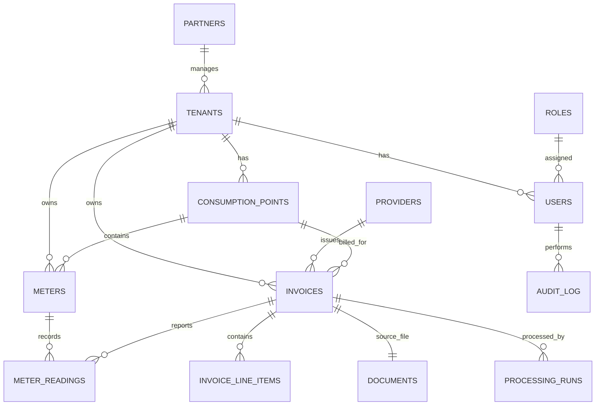

# Közmű Mester — Adatbázis terv

**Verzió:** 0.1.0
**Motor:** PostgreSQL 15+
**ORM:** SQLAlchemy 2.0 (declarative), migráció: Alembic

## 1. Alapelvek

- Minden ügyfélhez tartozó táblában `tenant_id UUID NOT NULL REFERENCES tenants(id)`.
- Minden táblának van `id UUID PRIMARY KEY DEFAULT gen_random_uuid()` kulcsa.
- Minden táblának van `created_at`, `updated_at` (TIMESTAMPTZ) mezője.
- Soft delete: `deleted_at TIMESTAMPTZ NULL` — nincs fizikai törlés ügyféladaton.
- Tenant izoláció: PostgreSQL Row Level Security (RLS) policy minden tenant-adatot
  tartalmazó táblán, `current_setting('app.current_tenant_id')` alapján, amit a
  backend minden connection checkout-nál beállít (SET LOCAL) a JWT-ből kinyert tenant_id-vel.
- Pénzösszegek: `NUMERIC(14,2)`, mennyiségek: `NUMERIC(14,4)` (a pontos átváltások miatt,
  pl. m³→kWh gáznál tizedesjegyre van szükség).
- Enumok PostgreSQL natív ENUM típusként, hogy adatbázis szinten is kikényszerítve legyenek.

## 2. ER diagram (magas szint)



## 3. Táblák

### 3.1 `partners`
Viszonteladó / tanácsadó cégek, akik több tenant-ot felügyelnek (csak olvasási jog).

| Mező | Típus | Megjegyzés |
|---|---|---|
| id | UUID PK | |
| name | VARCHAR(255) | |
| tax_number | VARCHAR(32) | magyar adószám |
| is_active | BOOLEAN | |
| created_at / updated_at / deleted_at | TIMESTAMPTZ | |

### 3.2 `tenants`
Előfizető ügyfél cégek — a multi-tenant izoláció gyökere.

| Mező | Típus | Megjegyzés |
|---|---|---|
| id | UUID PK | |
| partner_id | UUID FK → partners.id NULL | opcionális, ha partner kezeli |
| name | VARCHAR(255) | |
| tax_number | VARCHAR(32) | |
| subscription_plan | ENUM(trial, standard, pro, enterprise) | |
| subscription_status | ENUM(active, suspended, cancelled) | |
| gcs_prefix | VARCHAR(255) | tárolási elérési út prefix |
| is_active | BOOLEAN | |
| created_at / updated_at / deleted_at | | |

### 3.3 `roles`
Statikus szerepkör lista (seed adat): `super_admin`, `admin`, `partner`, `customer_admin`, `customer_user`.

| Mező | Típus |
|---|---|
| id | SMALLINT PK |
| code | VARCHAR(32) UNIQUE |
| description | VARCHAR(255) |

### 3.4 `users`

| Mező | Típus | Megjegyzés |
|---|---|---|
| id | UUID PK | |
| tenant_id | UUID FK NULL | NULL, ha super_admin/admin/partner szintű user |
| partner_id | UUID FK NULL | partner-user esetén |
| role_id | SMALLINT FK → roles.id | |
| email | CITEXT UNIQUE | |
| hashed_password | VARCHAR(255) | argon2 hash |
| full_name | VARCHAR(255) | |
| is_active | BOOLEAN | |
| last_login_at | TIMESTAMPTZ NULL | |
| allowed_consumption_point_ids | UUID[] NULL | ügyfél felhasználó telephely-szintű korlátozásához (NULL = mind) |
| created_at / updated_at / deleted_at | | |

### 3.5 `providers`
Szolgáltatók törzsadata (MVHU, E.ON, ELMŰ, NKM, Fővárosi Vízművek, FŐTÁV, stb.), szolgáltatónkénti
parser-konfigurációval.

| Mező | Típus | Megjegyzés |
|---|---|---|
| id | UUID PK | |
| name | VARCHAR(255) | |
| tax_number | VARCHAR(32) NULL | |
| utility_types | utility_type[] | mely közműveket szolgáltatja |
| parser_key | VARCHAR(64) | a parser modul registry kulcsa (pl. `mvm_next_electricity_v1`) |
| detection_patterns | JSONB | logó/szöveg alapú azonosító minták (nem regex-kinyerés, csak *azonosítás*) |
| is_active | BOOLEAN | |
| created_at / updated_at | | |

> **Fontos distinkció:** `detection_patterns` csak a *szolgáltató beazonosítására* szolgál
> (pl. "ez a PDF az E.ON-tól jött"), NEM az adatkinyerésre. Az adatkinyerés AI + validáció
> feladata, ahogy az architektúra tervben (03) részletezve van.

### 3.6 `consumption_points` (fogyasztási helyek)

| Mező | Típus | Megjegyzés |
|---|---|---|
| id | UUID PK | |
| tenant_id | UUID FK | |
| name | VARCHAR(255) | pl. "Budapest, Váci út 1. — Telephely" |
| address | VARCHAR(500) | |
| utility_type | ENUM(electricity, gas, water, sewage, district_heating, waste) | |
| pod | VARCHAR(64) NULL | Point of Delivery (villany/gáz) |
| poc | VARCHAR(64) NULL | Point of Connection |
| heating_center_id | VARCHAR(64) NULL | hőközpont azonosító (távhő) |
| created_at / updated_at / deleted_at | | |

Index: `(tenant_id, pod)`, `(tenant_id, utility_type)`.

### 3.7 `meters` (mérők)

| Mező | Típus | Megjegyzés |
|---|---|---|
| id | UUID PK | |
| tenant_id | UUID FK | |
| consumption_point_id | UUID FK → consumption_points.id | |
| serial_number | VARCHAR(128) | mérő gyári száma |
| meter_type | ENUM(electricity, gas, water, heat) | |
| unit | VARCHAR(16) | kWh, m3, GJ, stb. |
| created_at / updated_at / deleted_at | | |

Index: `(tenant_id, serial_number)`.

### 3.8 `documents` (feltöltött fájlok)

| Mező | Típus | Megjegyzés |
|---|---|---|
| id | UUID PK | |
| tenant_id | UUID FK | |
| uploaded_by_user_id | UUID FK → users.id | |
| original_filename | VARCHAR(500) | |
| gcs_path | VARCHAR(1000) | eredeti PDF elérési útja GCS-en |
| content_hash | CHAR(64) | SHA-256, determinizmus + duplikátum-szűrés miatt |
| file_size_bytes | BIGINT | |
| page_count | INTEGER NULL | |
| is_digital | BOOLEAN NULL | szöveg-réteg detektálás eredménye |
| ocr_text | TEXT NULL | teljes OCR/kinyert szöveg |
| ocr_engine | VARCHAR(64) NULL | pl. `tesseract_v5`, `native_text` |
| status | ENUM(uploaded, processing, done, failed, needs_review) | |
| created_at / updated_at / deleted_at | | |

Unique index: `(tenant_id, content_hash)` — ugyanaz a PDF kétszer nem dolgozódik fel feleslegesen.

### 3.9 `invoices` (számlák — a kinyert fejléc-adatok)

| Mező | Típus | Megjegyzés |
|---|---|---|
| id | UUID PK | |
| tenant_id | UUID FK | |
| document_id | UUID FK → documents.id UNIQUE | 1:1 dokumentum-számla |
| provider_id | UUID FK → providers.id NULL | |
| consumption_point_id | UUID FK → consumption_points.id NULL | |
| utility_type | ENUM | villany/gáz/víz/csatorna/távhő/hulladék |
| invoice_type | ENUM(commercial, network_usage_fee, capacity_fee, partial, settlement, storno, correction) | |
| delivery_format | ENUM(electronic, scanned_paper) | |
| invoice_number | VARCHAR(128) | |
| invoice_date | DATE | számla kelte |
| performance_date | DATE NULL | teljesítés dátuma |
| due_date | DATE NULL | fizetési határidő |
| billing_period_start | DATE NULL | |
| billing_period_end | DATE NULL | |
| pod | VARCHAR(64) NULL | |
| poc | VARCHAR(64) NULL | |
| metering_point | VARCHAR(64) NULL | |
| heating_center_id | VARCHAR(64) NULL | |
| meter_serial_number | VARCHAR(128) NULL | |
| contract_number | VARCHAR(128) NULL | |
| current_account_number | VARCHAR(128) NULL | folyószámla |
| partner_code | VARCHAR(64) NULL | |
| customer_reference | VARCHAR(128) NULL | ügyfélazonosító |
| net_amount | NUMERIC(14,2) NULL | |
| vat_amount | NUMERIC(14,2) NULL | |
| gross_amount | NUMERIC(14,2) NULL | |
| amount_due | NUMERIC(14,2) NULL | |
| currency | CHAR(3) DEFAULT 'HUF' | |
| meter_reading_start | NUMERIC(14,4) NULL | induló mérőállás |
| meter_reading_end | NUMERIC(14,4) NULL | záró mérőállás |
| consumption_value | NUMERIC(14,4) NULL | |
| consumption_unit | VARCHAR(16) NULL | kWh/m3/MJ/GJ |
| reactive_energy_value | NUMERIC(14,4) NULL | meddő energia |
| contracted_capacity_kw | NUMERIC(14,4) NULL | |
| measured_max_capacity_kw | NUMERIC(14,4) NULL | |
| ai_confidence_score | NUMERIC(5,4) NULL | 0.0000–1.0000, a strukturálási lépés önbizalmi score-ja |
| validation_status | ENUM(pending, valid, invalid, needs_review) | |
| processing_status | ENUM(queued, processing, done, failed, needs_review) | |
| raw_ai_json | JSONB NULL | a legutolsó sikeres AI strukturálás nyers kimenete (audit) |
| created_at / updated_at / deleted_at | | |

Indexek: `(tenant_id, invoice_number)`, `(tenant_id, provider_id)`, `(tenant_id, pod)`,
`(tenant_id, billing_period_start, billing_period_end)`, `(tenant_id, utility_type, invoice_type)`.

### 3.10 `invoice_line_items` (számlatételek)

| Mező | Típus | Megjegyzés |
|---|---|---|
| id | UUID PK | |
| tenant_id | UUID FK | |
| invoice_id | UUID FK → invoices.id | |
| line_number | INTEGER | megjelenési sorrend |
| description | VARCHAR(500) | tétel neve |
| quantity | NUMERIC(14,4) NULL | |
| unit | VARCHAR(16) NULL | |
| unit_net_price | NUMERIC(14,4) NULL | |
| net_value | NUMERIC(14,2) NULL | |
| vat_rate | NUMERIC(5,2) NULL | pl. 27.00 |
| vat_value | NUMERIC(14,2) NULL | |
| gross_value | NUMERIC(14,2) NULL | |
| created_at / updated_at | | |

Index: `(tenant_id, invoice_id)`.

### 3.11 `meter_readings`
Külön tábla a mérőállás-történethez (nem csak az invoice-on lévő 2 mezőben), hogy trend-elemzés
és időbeli lekérdezés is lehetséges legyen mérőnként.

| Mező | Típus | Megjegyzés |
|---|---|---|
| id | UUID PK | |
| tenant_id | UUID FK | |
| meter_id | UUID FK → meters.id | |
| invoice_id | UUID FK → invoices.id NULL | melyik számla jelentette |
| reading_date | DATE | |
| reading_type | ENUM(start, end) | |
| value | NUMERIC(14,4) | |
| reading_method | ENUM(actual, estimated) NULL | |
| created_at | | |

### 3.12 `processing_runs` (pipeline futások — teljes nyomonkövethetőség)

| Mező | Típus | Megjegyzés |
|---|---|---|
| id | UUID PK | |
| tenant_id | UUID FK | |
| document_id | UUID FK → documents.id | |
| invoice_id | UUID FK → invoices.id NULL | sikeres futás esetén kitöltve |
| attempt_number | INTEGER | hányadik újrafeldolgozási kísérlet |
| pipeline_stage | ENUM(text_extraction, ocr, doc_type_classification, provider_classification, invoice_type_classification, parsing, ai_structuring, validation, reprocessing) | |
| status | ENUM(success, failed) | |
| input_snapshot | JSONB NULL | az adott lépés bemenete (rövidített/hash) |
| output_snapshot | JSONB NULL | az adott lépés kimenete |
| error_message | TEXT NULL | |
| duration_ms | INTEGER NULL | |
| ai_model | VARCHAR(64) NULL | melyik modell/verzió végezte |
| created_at | | |

Ez a tábla adja a "miért lett ez az eredmény" kérdésre a választ — kritikus a determinizmus
és a hibakeresés szempontjából is.

### 3.13 `validation_issues`

| Mező | Típus | Megjegyzés |
|---|---|---|
| id | UUID PK | |
| tenant_id | UUID FK | |
| invoice_id | UUID FK → invoices.id | |
| processing_run_id | UUID FK → processing_runs.id | |
| rule_code | VARCHAR(64) | pl. `NET_VAT_GROSS_MISMATCH`, `METER_READING_INCONSISTENT` |
| severity | ENUM(warning, error) | |
| message | VARCHAR(1000) | |
| field_name | VARCHAR(128) NULL | |
| resolved | BOOLEAN DEFAULT false | |
| resolved_by_user_id | UUID FK NULL | |
| created_at | | |

### 3.14 `audit_log`

| Mező | Típus | Megjegyzés |
|---|---|---|
| id | UUID PK | |
| tenant_id | UUID FK NULL | |
| user_id | UUID FK NULL | |
| action | VARCHAR(64) | pl. `invoice.update`, `user.create`, `login` |
| entity_type | VARCHAR(64) | |
| entity_id | UUID NULL | |
| metadata | JSONB NULL | |
| ip_address | INET NULL | |
| created_at | | |

## 4. Enum lista összefoglaló

```sql
CREATE TYPE utility_type AS ENUM (
    'electricity', 'gas', 'water', 'sewage', 'district_heating', 'waste'
);

CREATE TYPE invoice_type AS ENUM (
    'commercial', 'network_usage_fee', 'capacity_fee', 'partial',
    'settlement', 'storno', 'correction'
);

CREATE TYPE delivery_format AS ENUM ('electronic', 'scanned_paper');

CREATE TYPE document_status AS ENUM (
    'uploaded', 'processing', 'done', 'failed', 'needs_review'
);

CREATE TYPE processing_status AS ENUM (
    'queued', 'processing', 'done', 'failed', 'needs_review'
);

CREATE TYPE validation_status AS ENUM ('pending', 'valid', 'invalid', 'needs_review');

CREATE TYPE subscription_plan AS ENUM ('trial', 'standard', 'pro', 'enterprise');

CREATE TYPE subscription_status AS ENUM ('active', 'suspended', 'cancelled');
```

## 5. Row Level Security minta

```sql
ALTER TABLE invoices ENABLE ROW LEVEL SECURITY;

CREATE POLICY tenant_isolation_invoices ON invoices
    USING (tenant_id = current_setting('app.current_tenant_id')::uuid);
```

A backend minden kérés elején (dependency injection réteg) beállítja:

```sql
SET LOCAL app.current_tenant_id = '<jwt-ből kinyert tenant_id>';
```

Super Admin/Admin szerepkör esetén külön, RLS-t megkerülő adminisztrátori DB szerepkör
(vagy BYPASSRLS jog) használatos, kizárólag a super admin API rétegen keresztül elérhető módon.

## 6. Migrációs stratégia

- Alembic, minden módosítás külön migrációs fájlban, `alembic revision --autogenerate` +
  kézi review (az autogenerate nem mindig veszi észre az enum/RLS változásokat).
- Seed adat (roles, alap providers lista) külön `seed` scriptben, nem migrációban.
