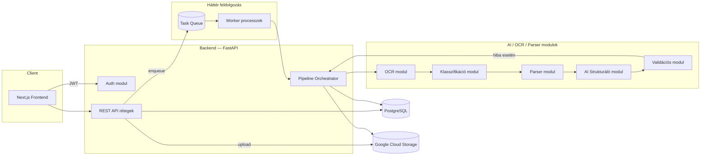

# Közmű Mester — Architektúra terv

**Verzió:** 0.1.0

## 1. Komponens áttekintés



## 2. Miért nem elég a puszta prompt / regex

Egyetlen "dobd be a PDF-et egy promptba" megoldás nem determinisztikus, nem auditálható,
és a hosszú, változatos magyar számlaformátumok mellett magas hibaarányt eredményez.
Ehelyett **több, egymásra épülő, önállóan tesztelhető lépés** dolgozza fel a dokumentumot,
mindegyik lépés kimenete külön tárolva és validálva (lásd `processing_runs` tábla, 02. doc).

A rendszer célja **hibrid megközelítés**:
- **Determinisztikus lépések** ott, ahol lehet (PDF szerkezet-felismerés, szolgáltató
  azonosítás logó/fejléc alapján, számlatípus kulcsszavak+AI kombinációja).
- **AI-alapú strukturálás** a tényleges mezőkinyerésre, de **kényszerített kimeneti
  sémával** (JSON Schema / tool-use), nem szabad szöveges válasszal.
- **Szabály-alapú validáció** minden AI kimeneten (számtani egyezőség, dátum-logika,
  mezőformátum, plauzibilitás — pl. egy villany fogyasztás nem lehet negatív).
- **Automatikus újrafeldolgozás** eltérő stratégiával, ha a validáció bukik.

## 3. Pipeline lépések részletesen

### 3.1 PDF beolvasás és digitális/szkennelt detektálás
- `pypdf` / `pdfminer.six` segítségével szöveg-réteg kinyerési kísérlet.
- Heurisztika: ha a kinyert karakterek száma / oldal < küszöb, vagy a szöveg zöme
  nem-ábécé karakter → szkennelt dokumentum.
- Eredmény: `documents.is_digital` mező, `pipeline_stage=text_extraction`.

### 3.2 OCR (ha szkennelt)
- Google Cloud Vision API (elsődleges, magyar nyelven jó pontosságú) — modul mögötti
  interfész (`OcrEngine` Protocol), így a konkrét motor cserélhető/tesztelhető
  (fallback: Tesseract, ha nincs Cloud Vision kulcs konfigurálva a dev/self-hosted módhoz).
- Eredmény: `documents.ocr_text`, `documents.ocr_engine`.

### 3.3 Dokumentumtípus felismerés
- Cél: eldönteni, hogy ez egyáltalán közüzemi számla-e, és ha igen, elektronikus vagy
  szkennelt papíralapú-e (ez utóbbi már ismert az 1. lépésből, itt csak megerősítjük
  osztályozással, ha kétértelmű).
- AI klasszifikációs hívás kis, gyors modellel + kényszerített enum kimenet.

### 3.4 Szolgáltató felismerés
- Elsőként determinisztikus egyezés: `providers.detection_patterns` (cégnév, adószám,
  jellegzetes fejléc-string) keresése a kinyert szövegben.
- Ha nincs egyértelmű találat → AI klasszifikáció a szöveg alapján, majd az eredmény
  megerősítést kér (confidence score < küszöb esetén `needs_review`).

### 3.5 Számlatípus felismerés
- Kulcsszó-jelzők (pl. "RENDSZERHASZNÁLATI DÍJ", "SZTORNÓ", "HELYESBÍTŐ SZÁMLA") +
  AI klasszifikáció kombinációja — a kulcsszavak **jelzésként**, nem kizárólagos
  döntésként szolgálnak.

### 3.6 Speciális parser (szolgáltatónkénti)
- A `parsers` modul egy **registry**-t tartalmaz: `parser_key -> ParserStrategy`.
- Minden ismert, gyakori szolgáltatóhoz készül egy dedikált parser-osztály, amely ismeri
  az adott szolgáltató számlalayoutjának **szerkezeti** sajátosságait (pl. hol helyezkedik
  el a táblázat, milyen szekció-fejlécek vannak) — ez **nem** regex-es szövegkinyerés,
  hanem a dokumentum szegmentálása (mely szövegblokk melyik logikai szekcióhoz tartozik),
  amit aztán a következő lépés (AI strukturálás) kap meg kontextusként, felcímkézve.
- Ismeretlen/új szolgáltatónál: `generic_invoice_parser_v1` — általános szegmentálás,
  alacsonyabb elvárt confidence-szel, automatikusan `needs_review`-ba kerül alacsony
  bizonyosság esetén, és a rendszer idővel (admin jóváhagyással) tanulhat új parser-t.

### 3.7 AI strukturálás
- Bemenet: a szegmentált szöveg + a szolgáltató/számlatípus kontextus.
- Kimenet: **kényszerített JSON séma** (Anthropic tool-use / structured output),
  amely 1:1 megfeleltethető az `invoices` + `invoice_line_items` + `meter_readings`
  Pydantic modelleknek.
- `temperature=0`, rögzített modell-verzió, a modell/verzió `processing_runs.ai_model`
  mezőben naplózva — ez a determinizmus egyik pillére.
- Minden mezőhöz a modell ad egy **confidence** jelzést is (self-assessment), amit a
  validációs réteg felhasznál.

### 3.8 Validáció
Szabály-alapú, kód szinten definiált ellenőrzések, pl.:
- `net_amount + vat_amount == gross_amount` (kerekítési tűréssel)
- `meter_reading_end - meter_reading_start == consumption_value` (ha mindhárom kitöltött)
- `invoice_date <= due_date`, `billing_period_start <= billing_period_end`
- Kötelező mezők megléte számlatípusonként (pl. RHD számlánál a POD kötelező)
- Formátum-validáció (POD formátum: `HU` + 16 karakter, EAN13-szerű ellenőrző számjegy)
- Historikus plauzibilitás: ha van korábbi számla ugyanarra a fogyasztási helyre,
  a fogyasztás nem térhet el irreálisan (pl. >500%) anélkül, hogy figyelmeztetést kapna.

Minden megsértett szabály `validation_issues` rekordot hoz létre `severity` szinttel.
`error` szintű probléma esetén `invoices.validation_status = invalid`.

### 3.9 Hibakeresés és automatikus újrafeldolgozás
- Ha `validation_status = invalid` és `attempt_number < MAX_ATTEMPTS` (konfigurálható, pl. 3):
  - Az orchestrator **más stratégiával** próbálkozik újra: pl. a konkrét hibás mezőkre
    célzott, kiegészítő kontextusú AI hívás ("a nettó+ÁFA nem adja ki a bruttót, nézd át
    újra ezt a 3 mezőt"), vagy nagyobb reasoning-effort modellel.
  - Minden kísérlet külön `processing_runs` rekord (`attempt_number` növekszik).
- Ha `MAX_ATTEMPTS` után is `invalid`: `invoices.processing_status = needs_review`,
  emberi review-ra vár admin felületen, ahol a validációs hibák és az AI nyers kimenet
  is látható a döntéshez.

### 3.10 Adatbázis mentés
- Csak validált (vagy explicit admin által jóváhagyott) adat kerül "végleges" állapotba,
  de a `needs_review` állapotú rekordok is látszanak a rendszerben (nem tűnnek el),
  megfelelő jelöléssel.

## 4. Determinizmus biztosítása — összefoglaló

| Mechanizmus | Hogyan |
|---|---|
| Tartalom-hash cache | `documents.content_hash` alapján, ugyanaz a PDF nem megy újra a teljes pipeline-on, ha már van kész, `valid` eredménye |
| Rögzített modell-verzió | Nincs "latest" alias használat a strukturáló hívásokban, csak konkrét verziószám |
| temperature=0 + structured output | Kizárja a szabad-szöveges variabilitást |
| Szabály-alapú validáció | Nem AI dönt arról, hogy "jó-e" az eredmény, hanem determinisztikus kód |
| Teljes futás-napló | `processing_runs` — minden lépés bemenete/kimenete visszakereshető, reprodukálható |

## 5. Modul-határok (backend Python csomagok)

```
app/
  auth/        # JWT, jelszókezelés, RBAC dependency-k, tenant context
  db/          # SQLAlchemy engine/session, Base, RLS session setup
  models/      # SQLAlchemy ORM modellek (02. doc alapján)
  schemas/     # Pydantic sémák (API I/O + AI strukturálási kényszerített séma)
  ocr/         # OcrEngine interfész + implementációk (Vision API, Tesseract)
  classification/  # dokumentumtípus, szolgáltató, számlatípus klasszifikáció
  parsers/     # ParserStrategy interfész + registry + szolgáltatónkénti implementációk
  ai/          # AI strukturáló kliens (Anthropic), prompt sablonok, self-confidence kezelés
  validation/  # szabály-motor, validation_issues generálás
  pipeline/    # orchestrator — összefűzi a fenti lépéseket, retry-logika
  storage/     # GCS kliens, signed URL generálás
  reports/     # Excel/CSV/PDF export
  assistant/   # NL keresés — tool-use alapú, DB lekérdezésre fordító réteg
  api/         # FastAPI routerek (v1)
  core/        # config, logging, exception handlerek
```

Minden modul **interfészen keresztül** kommunikál a szomszédjával (pl. `OcrEngine`
Protocol, `ParserStrategy` ABC), hogy egységtesztelhető és cserélhető legyen anélkül,
hogy a pipeline többi része tudna a konkrét implementációról.

## 6. Aszinkron feldolgozás

- Task queue: **Celery + Redis** (egyszerű, jól dokumentált, Cloud Run/GKE-n is jól üzemeltethető)
  — alternatíva lenne Cloud Tasks, de Celery önhosztolt/portabilis marad felhő-függetlenül.
- API réteg csak enqueue-ol és azonnal válaszol (`202 Accepted` + `processing_status=queued`),
  a frontend polling-gal vagy WebSocket értesítéssel követi a státuszt.

## 7. Technológiai stack — indoklás

| Réteg | Választás | Indoklás |
|---|---|---|
| Backend | Python + FastAPI | natív async, Pydantic validáció, kiváló OpenAPI dokumentáció |
| Frontend | Next.js + React + Tailwind | SSR/SEO nem kritikus, de a Next.js routing/App Router jól skálázódik, gyors admin UI fejlesztés |
| DB | PostgreSQL | RLS, JSONB, natív enum, tranzakcionális integritás pénzügyi adatokhoz |
| ORM | SQLAlchemy 2.0 | típusos, Alembic migrációval jól integrált |
| Tárolás | Google Cloud Storage | olcsó, signed URL, jól skálázódik nagy PDF mennyiségre |
| Auth | JWT (access+refresh) + RBAC | statless API skálázáshoz, finomhangolható jogosultsághoz |
| Queue | Celery + Redis | érett, jól dokumentált, önhosztolható |
| OCR | Google Cloud Vision (elsődleges), Tesseract (fallback) | magyar nyelvi pontosság |
| AI strukturálás | Anthropic Claude (tool-use / structured output) | megbízható kényszerített-séma kimenet, jó magyar nyelvi megértés |
| CI/CD | GitHub Actions | natív GitHub integráció, pytest + lint pipeline |
| Konténerizáció | Docker + docker-compose (dev), később Cloud Run/GKE (prod) | |

## 8. Biztonsági rétegek

1. Hálózati szint: HTTPS mindenhol, GCS bucket nem publikus, csak signed URL.
2. API szint: JWT middleware minden védett route-on, RBAC dependency minden endpoint-on
   explicit deklarálva (nincs "alapértelmezett" hozzáférés).
3. DB szint: RLS policy tenant-onként, második védelmi vonalként az alkalmazói kód
   esetleges hibája ellen.
4. Audit: minden írás-művelet `audit_log`-ba kerül.
